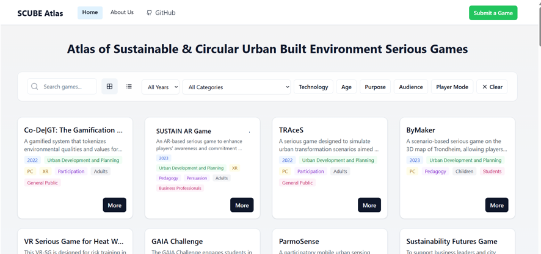

Atlas of Sustainable and Circular Urban Built Environment Serious Games (SCUBE Atlas)
===================

The SCUBE Atlas is an open, searchable repository of serious games that tackle sustainability and circularity challenges in the built environment. It brings together games that were previously scattered across academic literature, categorises them across multiple themes, and makes them more accessible for players, researchers, and developers.

🎯 Purpose
===================
Serious games in the built environment are often designed to educate, engage, or inspire action on sustainability topics. However, many are isolated, hard to access, or difficult to compare across themes.
The SCUBE Atlas solves this by:

* Consolidating serious games from academic sources (158 games from 2013–2025)
* Classifying them by purpose, audience, game mode, and sustainability theme
* Presenting them in an interactive web platform for easier discovery and reuse

🔍 Data
===================
SCUBE Atlas Website is built on a systematic review of academic literature using Scopus (486 papers), and provides overview and thematic categorisation of 158 final papers/games.

Work in progress
===================
We are publishing our results as two journal articles. In the meantime, you can have a sneakpeek of our systematic review:

Reference
===================
Akbarieh, A., Han, Q., & Klippel, A. (in Review). Atlas of the Serious Games in the Urban Built Environment. 2nd GeoGame Symposium, Dublin, June 9–10, 2025.
